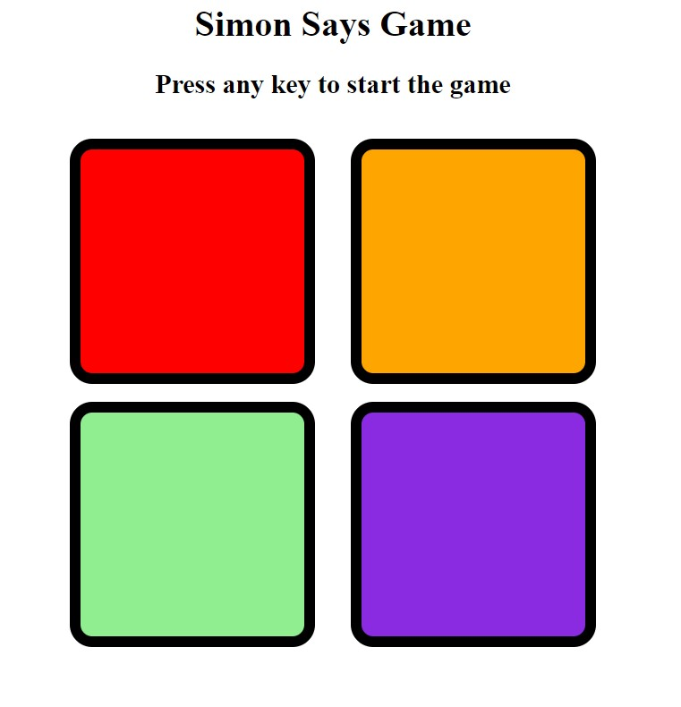

# Simon-Says-Game
This repository contains a simple and interactive Simon Says game, built using HTML, CSS, and JavaScript. It’s a fun and challenging memory game where players must repeat the sequence of colors in the correct order as it becomes progressively harder.

# Features
- Engaging gameplay with increasing difficulty.
- Interactive UI with sound effects for a better user experience.
- Fully responsive design for desktop and mobile devices.

# Gameplay Instructions
1. Press any key to start the Game.
2. Watch the sequence of colors light up.
3. Repeat the sequence by clicking the color buttons in the correct order.
4. The sequence will grow longer with each round.
5. If you click the wrong button, the game is over and the score will be onscreen.
6. For Restarting the start you have to follow step 1 again.

# Screenshots

# Contributing
Contributions are welcome! If you have ideas for new features or improvements, feel free to fork the repository and submit a pull request.
